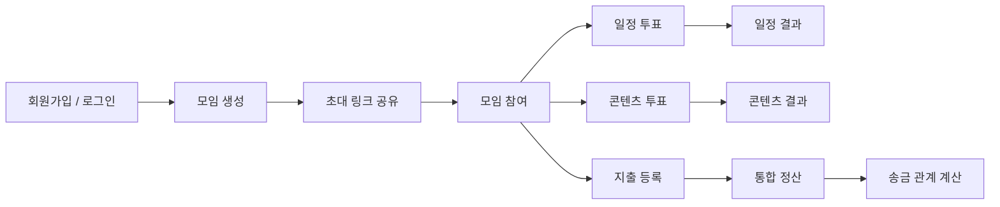
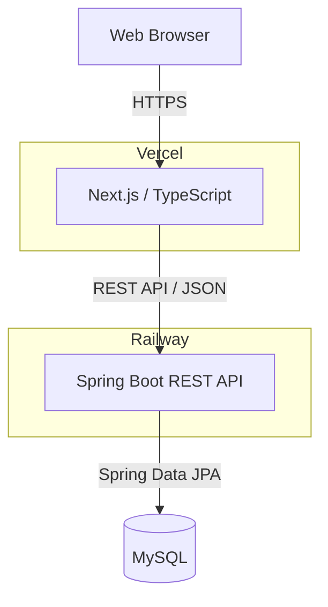

<div align="center">

# "모임 구축해주겠어"

### 일정 조율부터 콘텐츠 결정, 정산까지 한 곳에서

여러 명이 함께하는 모임에서 흩어지기 쉬운 **일정 조율, 콘텐츠 투표, 지출 및 정산 과정**을  
하나의 모임 안에서 관리할 수 있도록 돕는 서비스입니다.

[서비스 바로가기](https://nbe-12-14-2-team02.vercel.app)
[swagger](https://nbe12-14-2-team02-production.up.railway.app/swagger-ui/index.html#/)
[ERD](https://www.erdcloud.com/d/MQ5G84GCBHH3ghK2N)

</div>

---

## 📌 프로젝트 소개

모임을 준비할 때는 가능한 날짜를 맞추고, 무엇을 할지 정하고, 모임이 끝난 뒤에는 여러 지출을 다시 정산해야 합니다.

**모임 구축해주겠어**는 이 과정을 하나의 서비스에서 관리합니다.

- 후보별 선호도를 반영한 일정 조율
- 모임원이 함께 참여하는 콘텐츠 결정
- 지출 참여자를 기준으로 한 통합 정산
- 초대 링크를 통한 모임 참여
- 투표 종료 및 정산 완료 알림

---

## ✨ 주요 기능

### 👤 회원
- 이메일 기반 회원가입 및 로그인
- JWT 기반 인증
- 회원 정보 조회 및 수정
- 로그아웃 및 회원 탈퇴

### 👥 모임
- 모임 생성 및 정보 관리
- 초대 링크를 통한 모임 참여
- 모임장 / 일반 참여자 권한 구분
- 모임 탈퇴 및 종료

### 📅 일정 조율
- 일정 투표 및 날짜 후보 등록
- 후보별 `선호 / 가능 / 별로 / 불가` 입력
- 선호도 점수를 기반으로 한 투표 결과 제공
- 마감 시간 기준 자동 종료

### 🎯 콘텐츠 결정
- 모임원이 콘텐츠 후보 등록
- 후보별 선호도 입력 및 변경
- 점수 집계를 통한 결과 제공
- 마감 시간 기준 자동 종료

### 💰 정산
- 지출 내역 및 실제 지출 참여자 등록
- 참여자별 부담 금액 계산
- 전체 지출을 반영한 최종 차액 계산
- 송금자와 수취인을 매칭한 최종 송금 내역 제공
- 모임별 정산 계좌 관리

### 🔔 알림
- 일정 투표 종료 알림
- 콘텐츠 투표 종료 알림
- 최종 정산 완료 알림
- 읽음 / 안 읽음 상태 관리

---
서비스 흐름
---

---
## Architecture



---
## 🛠 Tech Stack

### Backend

| | Technology |
| --- | --- |
| Language | Java 25 |
| Framework | Spring Boot 4.1.1 |
| ORM | Spring Data JPA |
| Security | Spring Security, JWT (JJWT 0.13.0) |
| Database | MySQL |
| API Docs | SpringDoc OpenAPI / Swagger |
| Build | Gradle |

### Frontend

| | Technology |
| --- | --- |
| Framework | Next.js 16 |
| UI | React 19 |
| Language | TypeScript |
| Styling | Tailwind CSS 4 |
| Deployment | Vercel |

### Infra & Collaboration

| | Technology |
| --- | --- |
| Backend Deployment | Railway |
| Database | MySQL |
| Local DB | Docker Compose |


---

## 📁 Project Structure

```text
NBE12-14-2-Team02/
├── backend/                 # Spring Boot Backend
│   ├── src/
│   ├── compose.yml          # Local MySQL
│   ├── .env.example
│   └── build.gradle
│
├── frontend/                # Next.js Frontend
│   ├── src/
│   └── package.json
│
└── README.md
```
---
## Getting Started
### Backend
#### 1. 환경변수 설정

`backend/.env.example`을 복사해 `backend/.env`를 만듭니다.

```bash
cd backend
cp .env.example .env
```

`.env`에서 MySQL 접속 정보를 설정하고, `JWT_SECRET`을 추가합니다.

```env
MYSQLHOST=localhost
MYSQLPORT=3306
MYSQLDATABASE=team02
MYSQLUSER=team02_user
MYSQLPASSWORD=your_password
MYSQL_ROOT_PASSWORD=your_root_password
JWT_SECRET=your_jwt_secret
```

#### 2. MySQL 실행

```bash
docker compose up -d
```

#### 3. 애플리케이션 실행

```bash
./gradlew bootRun
```

서버 실행 후 API 문서는 [http://localhost:8080/swagger-ui/index.html](http://localhost:8080/swagger-ui/index.html)에서 확인할 수 있습니다.

### Frontend

#### 1. 의존성 설치

```bash
cd frontend
npm install
```

#### 2. 환경변수 설정

로컬 프론트 환경변수는 `frontend/.env.local`에 둡니다. 

```env
# frontend/.env.local
NEXT_PUBLIC_API_URL=http://localhost:8080
```

#### 3. 개발 서버 실행

```bash
npm run dev
```

브라우저에서 [http://localhost:3000](http://localhost:3000)을 엽니다.


---

## Team

**Programmers Backend Devcourse 12기 14회차 · Team 02**

| GitHub |
| --- |
| [@sowon11](https://github.com/sowon11) |
| [@jihoo414-tech](https://github.com/jihoo414-tech) |
| [@jinni1](https://github.com/jinni1) |
| [@jjjonghyeon](https://github.com/jjjonghyeon) |
| [@minj00-kim](https://github.com/minj00-kim) |
